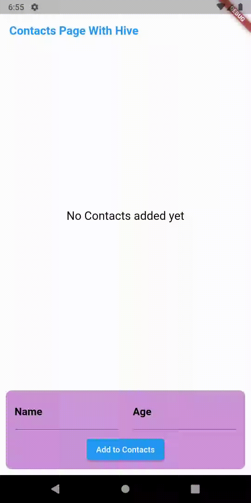

# hive_eg

A A Flutter example project of Hive Database implementation.

# Flutter_hive_eg

A Flutter project that explains about Hive Database with simple functionality, specially for beginners to understand easily.


## Packages Used

- [Hive Package](https://pub.dev/packages/hive)
- [Hive_Flutter Package](https://github.com/jinosh05/hive_flutter)
- [Path_provider Package](https://pub.dev/packages/path_provider)
- [Build_runner Package](https://pub.dev/packages/build_runner)
- [Analyzer Package](https://pub.dev/packages/analyzer)
 
 
 ## Screenshot



## Build Instructions

### Install Flutter

Built with [Flutter](https://flutter.dev/), you need to have `Flutter` dev tools
installed on your computer to compile the project. check [Flutter Documentation](https://flutter.dev/docs)
 to learn how to install `Flutter` and initialize a Flutter App.
 
 
### Run App

If you have an AVD or real device attached, you can do

```
flutter run 
```

### Build APK

You may build the App with Flutter's [Deployment Documentation](https://flutter.dev/docs).

In order to build a fat APK, you can do 
```
flutter build apk
```
and find the output in `build/app/outputs/flutter-apk/app-release.apk`

#### Dev hints

Currently supports flutter: 2.20

Re-generate contact_model.g.dart files
  flutter packages pub run build_runner build --delete-conflicting-outputs
  
  
# How to get this Repo and run it on your System

I kept the code as original as possible with proper Commented Guides for anyone to understand and implement. Still you need to follow these steps.
  - First get Flutter and all necessary SDK/Plugins installed. Full guide here [Flutter: Get Started](https://flutter.dev/docs/get-started/install)
  - Now download this [Repo](https://github.com/jinosh05/Flutter_hive_eg/zip/master)
  - Extract the Repo into your newly created **hive_eg** and replace the required files.
  - Now you can Finally run VS-Code or Android Studio whichever you prefer and get the flutter packages and just run the App.
  
# Download the APK


[Download Now](https://github.com/jinosh05/Flutter_hive_eg/raw/main/app-release.apk).
 
